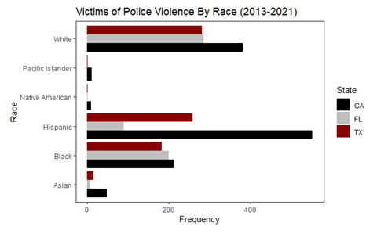
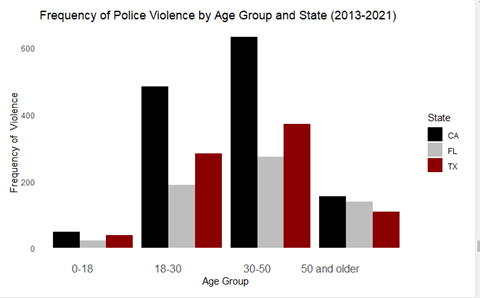

# Data Driven Policy: Police Violence In The Us
Hey All, This was a team project during the summer. Do enjoy our Analysis!

# EXECUTIVE SUMMARY

This data driven policy brief analyses police violence in the US from 2013-2021, considers resulting implications and provides precise recommendations about which policies need to be implemented to decrease police violence. The data analysis revealed that police violence is most predominant in California, Texas, and Florida, with individuals aged between 30-50 being targeted the most. Besides, the data demonstrated that police violence follows racial profiling as Hispanics, Whites and Blacks are most often affected. Resulting implications are therefore social injustice, loss of trust in public institutions, psychological and physical harm, and a threat to public safety. 

Governments are urged to implement four major recommendations, namely an anti-discrimination policy prohibiting racial profiling and violence; a policy on implicit bias training helping law enforcement to recognize, understand and mitigate their implicit bias; a policy on community collaboration fostering personal relationships and trust in law enforcement; and a policy on transparency, demanding police
officers to wear body cameras. 

# Introduction

In May 2020, public policy on police violence gained traction not only in the US but also on a global scale. This was when George Floyd – 46-year-old black US citizen – was brutally killed by police officers during a police intervention in Minneapolis (Hill et al., 2020).
The murder of Mr. Floyd triggered protests around the globe and since then, police violence related issues became even more recurrent topics in the news and public discussions. Is police violence targeting a specific demographic, and where in the US does it occur most frequently?

# How can governments intervene and change public policy so that police violence decreases?

This policy brief reviews a police violence database in the US from 2013 - 2021 and brings insights related to location, gender, age, race, and geography of over 9000 police violence cases. First, a research overview will be provided, showcasing the history of police
violence and current public policies. Next, the data will be analyzed by employing sophisticated data visualization methods, empowering readers to comprehend and engage with the findings effectively. Lastly, implications and recommendations will be provided, contributing to informed decision-making and the pursuit of evidence-based policy interventions.

# Research Overview

Police violence refers to the unjustified and excessive use of force by law enforcement, which can result in severe physical and psychological harm and even fatalities. It encompasses actions that are unreasonable and go beyond what is necessary in each situation. Unfortunately, police violence is often characterized by discriminatory practices that unfairly target individuals based on their race, ethnicity, gender, or religion.

# Police Violence Then and Now

Throughout history, police violence has been a contentious issue. In the 1830s and 1840s, authorities focused on maintaining civil order, monitoring freed slaves, and appeasing the interests of elites (National Black Lawyers, 2021). While the public supported controls on
the use of force, it often served the political desires of those in power. Instances of police violence, particularly against black Americans, have been prevalent throughout history. Martin Luther King, Jr. highlighted this issue in the 1960s, and advancements in technology and social media have made it more visible (National Black Lawyers, 2021).

Examples of police violence include the Chicago Police Department's killings in the late 19th and early 20th centuries, the racial profiling and resistance to civilian oversight by the Detroit Police Department during the civil rights movement, and the unlawful actions of the STRESS operation in Detroit in 1973 (National Black Lawyers, 2021). The most significant recent case is the killing of George Floyd in Minneapolis in 2020, which ignited global protests and calls for police reform (National Black Lawyers, 2021). These historical and contemporary instances demonstrate the ongoing problem of police violence in America and an urgent need
to address these issues.

## Research Approach

In this study, a dataset on police violence was thoroughly examined and sourced from Kaggle. The dataset spanned from 2013 to 2021. Before conducting the analysis, the data was cleaned, which included the elimination of blanks as well as removing data points that included above 10% unknown variables. A meticulous analysis was then conducted to identify patterns, trends, and factors associated with police violence incidents throughout the period in the US.

## Research Results

The results of the research demonstrate clear patterns and trends when analysing cases of police violence across different states. Some states had a higher concentration of reported incidents such as California, Texas, and Florida, which made them significant hotspots
compared to others. These findings shed light on the differences in regional police violence. Moreover, the study examined how these incidents affected different demographics, revealing interesting and uncommon trends, such as age group 30-50 years old as well as Hispanics and Whites being the races victimized the most by police violence.

Overall, the research findings offered a comprehensive understanding of police violence incidents across states. The identification of prominent regions and the exploration of demographic dynamics surrounding these incidents provide important information for discussions and initiatives on public policies aimed at addressing and mitigating police violence.

## Current Polices on Police Violence and Misconduct

The Fourth Amendment protects against unwarranted searches and seizures. Evidence obtained through illegal searches can be excluded from a case with the help of a criminal defence attorney (Arndt, 2021). 

The Department of Justice (DOJ) prevents police misconduct by forbidding officers from violating citizens' constitutional rights. They can investigate and request policy changes if a pattern of incidents is detected (Arndt, 2021). 

The Civil Rights Act of 1964 and the OJP Program Statute make it illegal for police officers to discriminate based on factors like colour, sex, race, religion, or national origin. Victims of such misconduct can file lawsuits under these laws (Arndt, 2021). 

Laws like the ADA and Rehabilitation Act protect people with disabilities from discrimination. They can seek compensation through the DOJ and file lawsuits if they experience discrimination (Arndt, 2021).

## Analysis of Research Findings

This section analyses data from over 9000 incidences of police violence from 2013- 2021 in the US. Maps and charts have been created to ease understanding of the analysis through visualization. 

Mapping Police Violence Across US-States

Figure 1: Police Violence by US State, 2013-2021

Figure 1 visualizes the proportions of police violence incidents across the US states. As can be observed, California, Texas and Florida are the three states with the highest level of police violence. 

This graph clearly highlights the top three states with the highest levels of police violence: California, Texas, and Florida. Whereas Texas is amongst the ten US states that have started to implement the strictest policies on combatting police violence since 2020, California has been facing issues with police violence for many years without major changes in public policy in recent years (Q1, Q2). 

It may be most surprising to find that Florida is ranked third in this report, as it is known for mass shootings, however not for police violence (Q3). Having analysed the US states with the highest level of police violence, it is necessary to identify the most affected target ages and races within these states in order to provide precise and relevant recommendations on public policy. 
 
 
 
 Understanding Police Violence by the Victims Race 

Figure 2: Victims of Police Violence by Race Across CA, TX & FL

Figure 2 visualizes the victims of police brutality by race across California, Texas, and Florida. It can be observed that Hispanics are the most affected race in California state followed by Whites and Blacks. In Texas, Whites are the most affected, followed by Hispanics and Blacks. In Florida, Whites are most often victims of police violence, followed by Blacks and Hispanics. 

Overall Hispanics and Whites are negatively impacted the most by police violence, whereas Asians, Pacific Islanders and North Americans are affected the least. To provide a holistic view on the demographics of victims of police violence, affected age groups will be analysed next.

Understanding Police Violence by the Victims Age Group 

Figure 3: Frequency of Police Violence by Age Group Across CA, TX & FL

Figure 3 illustrates which of the four age groups (0-18, 19-30, 31-50 and 50 + years) is impacted most by police violence in California, Florida, and Texas. A normal distribution shape can be observed, causing an increase of victims of police violence during young adultery which peaks in adulthood, after which a decrease with increasing seniority occurs. Generally, the age group with the highest number of victims are individuals aged 31-50, followed by the 19–30-year-old age group (given Figure 1, it is only accurate that California has the highest number of victims, followed by Texas and Florida). 

The difference between age group 19–39- and 31–50-year-olds may be attributed to the different age range of the respective group, meaning that recommendations, which will be evaluated next, should be inclusive of both age groups. 

 

# Implications and Recommendations 

Implications of Police Violence in the US
If public policy on police violence does not change drastically within the near future, there will be several implications, which will negatively impact society at large, but also law enforcement and the government. 

## Implications of Police Violence

1.	Social Injustice

As the data analysis has demonstrated, police violence mostly impacts minorities such as Hispanics, causing police violence to be perceived as targeting marginalized groups. It therefore reinforces a sense of discrimination and unjust treatment, which in turn perpetuates disparities in education and employment. 

2.	Public Safety

Police officers are supposed to establish a safe environment for all individuals in society, a statement that turns into wishful thinking when violence and force are implemented without any reason. This aggressive behaviour can cause individuals to not feel safe in public spaces anymore, especially if they are belonging to a minority, and thus increase tension between law enforcement and society.  

3.	Loss of Trust
	
Individuals witnessing police violence will likely develop a sense of scepticism, causing their trust in the police to heavily decrease. This mistrust may hinder effective collaborations between society and law enforcement, which are necessary to establish public safety. 

4.	Psychological and Physical Harm 
	
This implication relates to the victims of police violence and their relatives. Being hurt without reason can cause in severe injuries, depression or even death. Fear, trauma and suicide are only a few of the symptoms and actions taken by victims or their relatives because of police violence. Sometimes, as it was the case with the George Floyd murder, these harms can mobilize the masses and fuel social movements and activism, helping to end police violence. 
Specific recommendations on how governments can contribute to end police violence via public policy making will be discussed next. 

# Public Policy Recommendations 

Given the data analysis, these public policy recommendations on police violence are precise, relevant, credible, and feasible in nature as they are tailored to the most heavily impacted demographics (Hispanics, Whites and Blacks aged 31-50) and states (California, Texas and Florida). The US government is therefore advised to implement the following recommendations in these locations first.

## Recommendations to Decrease Police Violence in the US

1.	Implement a Anti-Discrimination Policy

The data analysis and research on existing policies led to the conclusion that police violence targets minority groups the most. This means that the ADA and Rehabilitation Act, which protects individuals from discrimination, must be extended and include a policy that strictly prohibits racial profiling and excessive use of force by law enforcement. Courts must enforce this policy without excuses and hold police officers accountable so that police violence will decrease. 

2.	Implement a Policy on mandatory training on implicit bias for police officers

To limit the racial profiling inherent in police violence, all police officers must participate in annual anti-discrimination and implicit bias trainings. These trainings will help law enforcement to recognize, understand and mitigate the impact of implicit bias, which will make them aware of and stop racial profiling. 

3.	Implement a Policy on Community Collaboration 

This policy demands the police officer to develop a relationship with the community they are assigned to. Specifically, this includes regular interactions with the community via town hall meetings to foster personal relationships, thus preventing racial profiling and the loss of trust in law enforcement. 

4.	Implement a Policy on Transparency

This policy will make the use of body-worn camaras mandatory for all police officers. The footage will be useful in determining whether violence was used unjustly or to self-protect. Additionally, this footage will be made publicly available to increase pressure on police officers to not use violence as this can trigger severe punishment as it was the case in George Floyd´s murder. 

# Conclusion

In conclusion, it becomes apparent that policy violence is a serious issue in the US which has caused activism and social movements to peak after George Floyd´s murder. Nevertheless, public policy making by the government has not yet resulted in significant improvements which can cause issues with regards to social justice, public safety, trust in law enforcement and the victims well-being. Given the targeting of police violence of minorities aged 31-50 resulting from the data analysis, the government is advised to implement four public policies in California, Texas and Florida, which are the states with the highest number of victims. These four policies include an anti-discrimination policy, which strictly prohibits the racial profiling and violence; a policy on implicit bias training, which will help law enforcement to recognize, understand, and mitigate implicit bias; a policy on community collaboration, which will foster personal relationships and trust in law enforcement; and a policy on transparency, demanding police officers to wear body cameras. In implementing these policies, society, law enforcement and the government benefit as public safety, trust and collaboration are re-established via the elimination of racial profiling and police violence. 
 

## Reference

https://www.nytimes.com/2020/05/31/us/george-floyd-investigation.html 
 
United States Police Brutality: Then and Now. (n.d.). National Black Lawyers. https://nbltop100.org/united-states-police-brutality-then-and-now/ 
 
H Law Group: What Are Some Laws That Protect Citizens From Police Misconduct? (n.d.). https://www.thehfirm.com/blog/what-are-some-laws-that-protect-citizens-from-police-misconduct 

Q 1: https://cochranfirm.com/10-states-combating-police-brutality/

Q2: https://www.worldatlas.com/articles/u-s-states-with-the-highest-rates-of-people-killed-by-police.html

Q3: https://www.statista.com/statistics/811541/mass-shootings-in-the-us-by-state/

